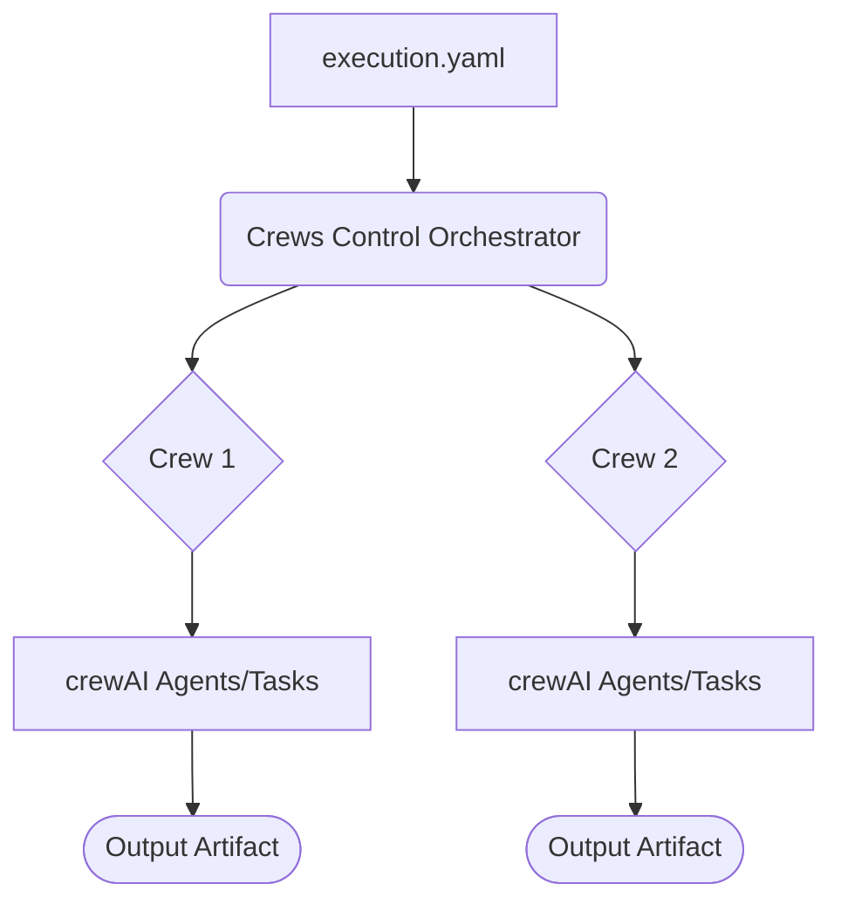

# Crews Control

## Acknowledgements

This project builds upon the following MIT-licensed project:

- crewAI: https://github.com/joaomdmoura/crewAI by João Moura | crewAI™, Inc.: https://github.com/joaomdmoura/
  

**Crews Control** is an abstraction layer on top of [crewAI](https://www.crewai.com/), designed to facilitate the creation and execution of AI-driven projects without writing code. By defining an `execution.yaml` file, users can orchestrate AI crews to accomplish complex tasks using predefined or custom tools.

## Core Concepts & Architecture

Crews Control orchestrates workflows by connecting a few key components defined in your `execution.yaml`.

* **Orchestrator:** The engine that reads your YAML and manages the overall workflow.
* **Crew:** A group of Agents assigned to complete a set of related Tasks.
* **Agent:** An autonomous AI worker with a specific role, goal, and set of Tools.
* **Task:** A single, well-defined unit of work performed by an Agent.

The relationship between these components follows this high-level architecture:



## Features

- **No-Code AI Orchestration:** Define projects with `execution.yaml`, specifying crews, agents, and tasks.
- **[Advanced Conditional Logic & Control Flow](#2-conditional-dependencies-dependson):** Orchestrate complex workflows with `and`/`or` dependencies, `run_until` loops, and `for_each` iterators.
- **[Per-Agent LLM Configuration](#6-per-agent-llms-llm_model):** Assign specific LLM providers and models to individual agents for fine-tuned performance and cost optimization.
- **[Dynamic & External Inputs](#5-external-content-the-context-block):** Define task inputs dynamically based on previous outcomes and load content from external files.
- **Modular Tools:** Use predefined tools or create your own to inject functionality into tasks.
- **[Deterministic Artifact Generation](#4-deterministic-naming-sha256):** Create unique, consistent output filenames based on input content.

## Licensing

This repository includes the following files which are licensed under the GNU General Public License (GPL) Version 3:

  - `requirements.in`
  - `requirements.txt`

The rest of the repository is licensed under the MIT License, which can be found in the `LICENSE` file.

### Legal Disclaimer

This project and all information herein is provided “as-is” without any warranties or representations. Axonius relies on licenses published by third parties for dependencies and background for this project and therefore does not warrant that the licenses presented herein are correct. Licensees should perform their own assessment before using this project.

### Main Project (MIT License)

All files in this repository, except for the `requirements.in` and `requirements.txt` files, are licensed under the MIT License. You can find the full text of the MIT License in the [LICENSE](LICENSE) file.

### Requirements Files (GPL License)

The `requirements.in` and `requirements.txt` files, which list the dependencies required to run this project, are licensed under the GNU General Public License (GPL). You can find the full text of the GPL in the [LICENSE-REQUIREMENTS](LICENSE-REQUIREMENTS) file.

## Known Issues

⚠️ Important Notice: Dependency Conflict (June 2025)
There is a known dependency conflict between the latest versions of the core crewai library and the embedchain library.

`crewai` (`>=0.134.0`) requires `chromadb >= 0.5.23`.

`embedchain` (and older versions of `crewai-tools` that depend on it) requires `chromadb < 0.5.0`.

These requirements are mutually exclusive.

To ensure the project remains stable and can incorporate critical security patches (like in the transformers library), the decision has been made to remove crewai-tools and embedchain as dependencies for now.

Impact on Functionality
As a result, the following pre-packaged tools are currently unavailable:

`SerperDevTool` (Internet Search)

`DirectorySearchTool`

`SeleniumScrapingTool` (Website Scraping)

`WebsiteContentQueryTool` (which relies on embedchain)

All custom tools and the core crewai agent/task/crew orchestration engine remain fully functional. This is a temporary measure pending updates from the upstream crewai and embedchain libraries.

## Prerequisites

1.  Python 3.12 (may work with other versions. Untested)

2.  Docker (optional) - to run dockerized version.

3.  Environment variables listed in [.env.example](.env.example)

### Environment Setup

The project requires certain environment variables to function correctly. You must provide a value for every variable listed in `.env.example`, even for services you do not plan to use.

1.  Copy the `.env.example` file and rename the copy to `.env`:

    ```bash
    cp .env.example .env
    ```

2.  Open the newly created `.env` file and fill in the values.

    **Note:** Due to a validation check that runs on startup, every environment variable must have a value. If you do not have credentials for a specific service (e.g., Jira, Confluence, Groq), you **must enter a placeholder value** (like "none" or "dummy_value") for its related variables to prevent the application from terminating with a configuration error.

    Make sure to keep the `.env` file secure and do not expose it publicly.

#### Environment Variables Details

**Core LLM & Tool Configuration**

*(This is where you would list variables already in `.env.example` like `OPENAI_API_KEY`, `GROQ_API_KEY`, `GITHUB_TOKEN`, etc.)*

**Jira Tools Configuration**

*These variables are mandatory at startup. Use placeholder values if you will not be using Jira tools.*

| Variable | Description | Example |
| :--- | :--- | :--- |
| `JIRA_LINK_ALLOWED_PAIRS` | Restricts ticket linking to specific project pairs. Each pair is separated by a `|`. | `PROJ1,PROJ2\|PROJ1,PROJ3` |
| `JIRA_ATTACH_ALLOWED_PREFIXES` | A comma-separated list of project prefixes where file attachments are permitted. | `PROJ,TEST` |
| `JIRA_REASSIGN_ALLOWED_PREFIXES` | A comma-separated list of project prefixes where ticket reassignments are permitted. | `PROJ,TEST` |
| `JIRA_SETPRIORITY_ALLOWED_PREFIXES`| A comma-separated list of project prefixes where priority changes are permitted. | `PROJ` |

**Azure Vision Service**

*These variables are mandatory at startup. Use placeholder values if you will not be using the `AdvancedImageAnalyzerTool`.*

| Variable | Description |
| :--- | :--- |
| `AZURE_API_KEY` | Your API key for the Azure Cognitive Services. |
| `AZURE_API_BASE` | The base endpoint URL for your Azure resource. |
| `AZURE_API_VERSION` | The API version for the Azure OpenAI service (e.g., `2024-02-01`). |
| `AZURE_OPENAI_VISION_DEPLOYMENT` | The name of your specific vision model deployment in Azure. |

## Installation

### Mac / Linux

1.  Clone the repository:

```bash
git clone https://github.com/Axonius/crews-control.git
cd crews-control
```

2.  Create a virtual environment

```bash
python -m venv .venv
source .venv/bin/activate
```

3.  Compile requirements.txt file (optional)

```bash
pip install pip-tools
pip-compile --generate-hashes requirements.in
```

4.  Install the dependencies:

```bash
pip install setuptools
pip install --require-hashes --no-cache-dir -r requirements.txt
```

#### Usage

**Run a project (interactive-mode):**

```bash
make run_it project_name=<PROJECT_TO_RUN>
```

**Run a project (cli-mode):**

```bash
python crews_control.py --project-name=<PROJECT_TO_RUN> --params input1="value 1" input2="value 2" ... inputN="value N"
```

Example - run the `pr-security-review` project to review `PR #1` of the `Axonius/crews-control` GitHub repository:

```bash
python crews_control.py --project-name pr-security-review --params github_repo_name="Axonius/crews-control" pr_number="1"
```

### Windows

Coming soon...

### Docker (tested on MacOS only)

1.  Clone the repository:

```bash
git clone https://github.com/Axonius/crews-control.git
cd crews-control
```

2.  Compile requirements.txt file (optional)

```bash
make compile-requirements
```

3.  Build the Crews-Control Docker image

```bash
make build
```

#### Usage

**Run a project (interactive-mode):**

```bash
make run_it project_name=<PROJECT_TO_RUN>
```

**Run a project (cli-mode):**

```bash
make run project_name=<PROJECT_TO_RUN> PARAMS="<input1='value 1' input2='value 2' ... inputN='value N'>"
```

Example - run the `pr-security-review` project to review `PR #1` of the `Axonius/crews-control` GitHub repository:

```bash
make run project_name=pr-security-review PARAMS="github_repo_name='Axonius/crews-control' pr_number='1'"
```

## Creating a Project: From Basic to Advanced

To get started, every project requires its own folder and a main `execution.yaml` file.

1.  **Create a Project Folder:** All projects live inside the `/projects` directory.
    ```bash
    mkdir projects/my-new-project
    ```
2.  **Create an `execution.yaml` File:** Inside your new folder, create the main configuration file.
    ```bash
    touch projects/my-new-project/execution.yaml
    ```

> **Pro-Tip:** You can use the built-in `bot-generator` project to create a boilerplate `execution.yaml` for you.

The following sections provide self-contained examples of what you can put inside your `execution.yaml` file, each demonstrating a core feature.

-----

### 1\. Basic Dependency

This is the simplest functional project. It defines two crews. `writer_crew` has a `depends_on` block, ensuring it only runs after `research_crew` is finished. The output of the first crew is available as a `{research_crew}` placeholder.

```yaml
user_inputs:
  topic:
    title: "Blog Post Topic"
crews:
  research_crew:
    agents:
      researcher:
        role: "Researcher"
        goal: "Find 3 key facts about {topic}."
        tools: [human]
        backstory: "An expert researcher."
    tasks:
      research_task:
        agent: researcher
        description: "Please provide 3 key facts about {topic}."
        expected_output: "A bulleted list."
  writer_crew:
    depends_on:
      - research_crew
    agents:
      writer:
        role: "Writer"
        goal: "Write a short paragraph based on the research."
        tools: []
        backstory: "A skilled writer."
    tasks:
      write_task:
        agent: writer
        description: "Write a paragraph based on these facts:\n{research_crew}"
        expected_output: "A single paragraph."
```
-----

### 2\. Conditional Dependencies (`depends_on`)

You can create powerful, branching workflows by adding a `condition` block to any dependency. The `condition` block supports three keys, which are checked with logical **AND** if multiple are used within the same condition.

  * `output_contains`: The crew runs if this string **is found** in the dependency's output.
  * `output_not_contains`: The crew runs if this string is **not found** in the dependency's output.
  * `status`: The crew runs if the dependency finished with a specific status (e.g., `SUCCESS`, `SKIPPED`).

You can combine multiple dependencies using `and` or `or` for complex scenarios. In the example below, the `escalation_crew` runs if **either** the manager explicitly says to escalate, **or** if a vulnerability was found **and** the manager was unavailable (i.e., their crew was skipped).

```yaml
user_inputs:
  scan_target:
    title: "Scan Target"
crews:
  analysis_crew:
    agents:
      analyzer:
        role: "Security Analyzer"
        goal: "Analyze the target and report vulnerabilities."
    tasks:
      analyze_task:
        agent: analyzer
        description: "Scan {scan_target}. If clean, respond with 'Target is CLEAN'."

  manager_approval_crew:
    # This crew only runs if the analysis is NOT clean
    depends_on:
      - crew: analysis_crew
        condition:
          output_not_contains: 'CLEAN'
    agents:
      manager:
        role: "Manager"
        goal: "Approve security findings for escalation."
        tools: [human]
    tasks:
      approval_task:
        agent: manager
        description: "Findings for {scan_target}:\n{analysis_crew}\nRespond with 'ESCALATE' or 'IGNORE'."

  escalation_crew:
    depends_on:
      or:
        # Case 1: The manager explicitly approved escalation.
        - crew: manager_approval_crew
          condition:
            output_contains: 'ESCALATE'
        # Case 2: The analysis found something AND the manager was unavailable to review it.
        - and:
            - crew: analysis_crew
              condition:
                output_not_contains: 'CLEAN'
            - crew: manager_approval_crew
              status: 'SKIPPED'
    agents:
      escalator:
        role: "Escalation Lead"
        goal: "Handle the security escalation."
    tasks:
      escalation_task:
        agent: escalator
        description: "Handle the security escalation for {scan_target} based on these findings:\n{analysis_crew}"
```

-----

### 3\. Looping with `run_until`

A crew can be set to run repeatedly until its output meets specific conditions. This `validator_crew` will run up to 5 times until its output contains "SUCCESS" **and** does not contain "ERROR". This is ideal for polling, validation, or self-correction loops.

```yaml
crews:
  validator_crew:
    run_until:
      max_retries: 5
      delay_seconds: 10
      condition:
        output_contains: "SUCCESS"
        output_not_contains: "ERROR"
    agents:
      validator:
        role: "Validator"
        goal: "Validate a process and report its status."
        tools: [human]
    tasks:
      validation_task:
        agent: validator
        description: "Please check the system status. If it's fully operational, respond with 'STATUS: SUCCESS'. If there is a problem, respond with 'STATUS: ERROR'."
```

**How it Works:**

  * The crew's output is checked after each run. All conditions in the `condition` block must be satisfied.
  * The loop will only stop when the output contains "SUCCESS" **AND** does not contain "ERROR".
  * If conditions are not met, it will retry until `max_retries` is reached.
  * **Note:** Set `max_retries: -1` for an infinite loop, which is useful for service-like polling.

#### Special Values

| Value             | Meaning                                    |
| ----------------- | ------------------------------------------ |
| `max_retries: -1` | Infinite retries (loop until success)      |
| `max_retries: 1+` | Retry that many times at most              |
| `max_retries: 0`  | ❌ Invalid — remove `run_until` to run once |
| `< -1`            | ❌ Invalid — will raise an error            |

#### Notes

* `delay_seconds` is optional but useful for rate limits or external dependencies.
* You can omit either `output_contains` or `output_not_contains` if only one condition is needed.
* Cached outputs are always ignored during retries to ensure fresh execution.
-----

### 4\. Iterating with `for_each`

The for_each property configures a crew to run its logic for every item in a list, making it ideal for processing a variable number of items like file chunks, search results, or API responses.

This property takes a string value that must resolve to a valid JSON array. This provides flexibility in how the list of items is generated: it can be hardcoded directly into the workflow, or dynamically generated by a previous crew's output.

**Example with a Hardcoded List:**
```yaml
crews:
  security_review_iterator:
    # The list of items is defined directly as a static JSON array string.
    for_each: '["User Onboarding", "Admin Dashboard", "Payment Gateway"]'

    agents:
      reviewer:
        role: "Security Analyst"
        goal: "Brainstorm threats for a specific software feature."

    tasks:
      brainstorm_task:
        agent: reviewer
        description: "List 3 potential security threats for the '{item}' feature."
        expected_output: "A bulleted list of three threats."
```

**Example with a Dynamically Generated List:**
```yaml
user_inputs:
  topic:
    title: "Topic to research"
crews:
  # 1. This crew generates a list of sub-topics
  sub_topic_generator_crew:
    agents:
      planner:
        role: "Planner"
        goal: "Generate a list of 3 related sub-topics for {topic}."
    tasks:
      generate_task:
        agent: planner
        description: "Generate 3 sub-topics related to {topic}."
        expected_output: >
          A single JSON array string. Example: ["Sub-topic A", "Sub-topic B", "Sub-topic C"]

  # 2. This crew iterates over the list from the previous crew
  research_iterator_crew:
    depends_on: [sub_topic_generator_crew]
    for_each: "{sub_topic_generator_crew}"

    # The rest of the definition is a normal crew
    agents:
      researcher:
        role: "Researcher"
        goal: "Find key facts about a sub-topic."
    tasks:
      research_task:
        agent: researcher
        description: "Find 3 key facts about this specific sub-topic: {item}"
        expected_output: "A bulleted list of 3 facts for the sub-topic."
```

#### How it Works:

- **`for_each: "{...}"`**: This property on a crew triggers the iteration. Its value is a template that must resolve to a JSON array string.
- **`{item}` Placeholder**: This is a special, reserved keyword. For each iteration, the framework replaces `{item}` with the current value from the list.
- **Aggregated Output**: The final output of the iterator crew (e.g., `{research_iterator_crew}`) will be a single JSON array string containing the results from all the individual runs.

### 5\. Per-Agent LLM Assignment

Optimize for cost and performance by assigning different LLMs to different agents. In this example, the `researcher` uses a fast, inexpensive model, while the `writer` uses a more powerful, creative model.

```yaml
user_inputs:
  topic:
    title: "Topic"
crews:
  research_crew:
    agents:
      researcher:
        llm_model:
          provider: 'groq'
          model_name: 'llama3-8b-8192'
        role: "Researcher"
        goal: "Find facts about {topic}."
        tools: [human]
        backstory: "An expert."
    tasks:
      research_task:
        agent: researcher
        description: "Provide facts on {topic}."
  writer_crew:
    depends_on: [research_crew]
    agents:
      writer:
        llm_model:
          provider: 'openai'
          model_name: 'gpt-4o'
        role: "Writer"
        goal: "Write a blog post about {topic}."
        tools: []
        backstory: "A creative writer."
    tasks:
      write_task:
        agent: writer
        description: "Write a post using these facts:\n{research_crew}"
```

-----

### 6\. Dynamic Task Inputs with `resolved_inputs`

Dynamically construct parts of a task's description based on the results of previous crews. This `summary_crew` changes its `final_summary` placeholder based on whether the `approval_crew` succeeded or was skipped.

```yaml
crews:
  approval_crew:
    run_until:
      max_retries: 3
      condition:
        output_contains: "APPROVE"
    agents:
      validator:
        role: "Validator"
        goal: "Get approval."
        tools: [human]
    tasks:
      validation_task:
        agent: validator
        description: "Review this. To approve, respond with 'APPROVE'."
        expected_output: "The word 'APPROVE'."
  summary_crew:
    depends_on: [approval_crew]
    agents:
      reporter:
        role: "Reporter"
        goal: "Summarize the outcome."
        tools: []
    tasks:
      report_task:
        agent: reporter
        description: "Task Status: {final_summary}"
        expected_output: "A final status report."
        resolved_inputs:
          final_summary:
            case:
              - condition:
                  crew: approval_crew
                  output_contains: "APPROVE"
                value: "The process was successfully APPROVED."
            default: "The process was NOT approved."
```

-----

### 7\. Other Templating Features

#### Using External Files with `context`

Keep your YAML clean by loading long prompts from external files in a `context/` sub-folder. This example loads `context/instructions.txt` into the `{instructions}` placeholder.

```yaml
crews:
  follower_crew:
    context:
      instructions: 'instructions.txt'
    agents:
      follower:
        role: "Follower"
        goal: "Follow instructions."
        tools: []
    tasks:
      follow_task:
        agent: follower
        description: "Execute these instructions:\n{instructions}"
```

#### Deterministic Filenames with `{sha256:...}`

Create consistent filenames based on the hash of an input. The output filename will be the same every time the same `report_id` is used.

```yaml
user_inputs:
  report_id:
    title: "Unique ID for the report"
crews:
  report_crew:
    output_naming_template: 'report_{sha256:report_id}.md'
    agents:
      reporter:
        role: "Reporter"
        goal: "Generate a report."
        tools: []
    tasks:
      report_task:
        agent: reporter
        description: "Generate the report for ID: {report_id}"
```

### Project Folder Structure

#### Required Files and Folders

1.  **execution.yaml**:

      - **Purpose**: This is the main configuration file for the project.
      - **Contents**:
          - **Required User Inputs**: Specifies the inputs that users need to provide for the execution of the project.
          - **Context File References**: References to any context files needed for the execution.
          - **Context Subfolder**:
              - If there are references to context files in the execution.yaml, these files should be placed in a subfolder named `context`.

2.  **benchmark.yaml** (Optional):

      - **Purpose**: Used for batch processing and validation of the project.
      - **Contents**:
          - **User Input Values**: Specifies multiple runs with various user inputs. Each run includes a set of user inputs.
          - **Validations**: Includes validation details for one or more crews within the project.
              - **Metrics**: For each crew, one or more metrics are provided to compare the crew's output against the expected output.
              - **Expected Output**: This can be provided either inline within the benchmark.yaml or as a reference to a file in the `validations` subfolder.
              - **Validation Results**: The result of each validation (either success or failure) is provided as a JSON string. In case of failure, the reason is included.

#### Subfolders

1.  **context**:

      - Contains context files referenced in the execution.yaml.

2.  **validations**:

      - Contains expected output files referenced in the benchmark.yaml.
      - Stores the JSON output of each validation with a `.result` extension.

#### Example Structure

```plaintext
project-folder/
├── execution.yaml
├── benchmark.yaml (optional)
├── context/ (only if context files are referenced)
│   ├── context-file1
│   └── context-file2
└── validations/ (only if validations are included)
    ├── expected-output1 (if expected output is given as a filename reference)
    ├── expected-output2
    ├── validation1.result (JSON output of validation)
    └── validation2.result
```

  * `project-folder` is the name of the project. It resides within the [projects](projects) folder.
  * See the [execution.yaml guide](/projects/bot-generator/context/guide.md) for detailed explanation on how to create one for your project.
  * You can use the [bot-generator project](projects/bot-generator) to assist you in generating an `execution.yaml` for your project:

```sh
make run-it PROJECT_NAME=bot-generator
```

And then move it to a dedicated project folder using the helper [create-project.py](create-project.py) script:

```sh
python create-project.py <projects/bot-generator/output/generated-execution.yaml> <your-project-name>
```

### Running a project

#### Interactive mode

Interactive mode prompts the user for inputs interactively, rather than requiring them to be passed as CLI parameters or hardcoded in a configuration file. This mode is particularly useful for development or testing purposes.

To start a project in interactive mode, use the following command:

```sh
make run_it PROJECT_NAME=<your_project_name>
```

Ensure you have set up the project and provided the necessary project name.

#### CLI mode

Command Line Interface (CLI) mode enables you to run the project with specific parameters, offering more control and flexibility.

To run a project in CLI mode, use the following command:

```sh
make run PROJECT_NAME=<your_project_name> PARAMS="key1=value1 key2=value2"
```

Replace <your_project_name> with the name of your project and specify the required parameters.

#### Batch mode with benchmarking

Batch mode with benchmarking allows you to run multiple tests and benchmarks on your project to evaluate performance and efficiency.

To run the project in batch mode with benchmarking, use:

```sh
make benchmark PROJECT_NAME=<your_project_name>
```

This mode is useful for performance testing and optimizing your project.

### Development

```sh
make dev
```

This command installs development dependencies and generates a license file for all included packages.

#### Building

To build the Docker image required for running the project, use:

```sh
make build
```

This command sets up the necessary environment and dependencies for your project.

#### Compiling requirements

```sh
make compile-requirements
```

This command uses pip-tools to generate hashed requirements files for a consistent and reproducible environment.

#### Creating tools

Agents can be set up to use tools by listing them in the `_TOOLS_MAP` dictionary found in the [tools/index.py](tools/index.py) file.

Please note that due to the dependency conflict mentioned above, some pre-packaged tools from the `crewai-tools` library are temporarily unavailable. However, creating and using your own custom tools is fully supported.

You can use the [tool-generator project](projects/tool-generator) to assist you in generating a required tool:

```sh
make run-it PROJECT_NAME=tool-generator
```

### Supported LLMs and Embedders

The project supports various Large Language Models (LLMs) and embedding models. To list the available models, use the following command:

```sh
make list-models
```

This will provide a list of supported models. Make sure to check the specific configuration and compatibility of the models with your project setup. The list of supported tools and models can be expanded as needed.

## Compliance

By using the dependencies listed in `requirements.txt`, you agree to comply with the terms of the GPL for those dependencies. This means that:

  - If you distribute a derivative work that includes GPL-licensed dependencies, you must release the source code of the entire work under the GPL.
  - You must include a copy of the GPL license with any distribution of the work.

## Contribution

Contributions to the main project code should be made under the terms of the MIT License. Contributions to the `requirements.in`, `requirements.txt` files should comply with the GPL.

## Third-Party Licenses

This project uses third-party packages that are distributed under their own licenses. For a full list of these packages and their licenses, see the [LICENSES.md](LICENSES.md) file.

## Contributors

This project exists thanks to all the people who contribute. Here are some of the key contributors:

  - **Avri Schneider** ([@avri-schneider](https://github.com/avri-schneider))
      - Initial project setup, documentation and main features
  - **Ido Azulay** ([@idoazulay](https://github.com/idoazulay))
      - Initial project setup, documentation and main features
  - **Sharon Ohayon** ([@sharonOhayon](https://github.com/sharonOhayon))
      - Initial project code review and quality assurance
  - **Aviad Feig** ([@aviadFeig](https://github.com/aviadFeig))
      - Initial project documentation, presentation and training materials
  - **Alexey Shchukarev** ([@AlexeyShchukarev](https://github.com/AlexeyShchukarev))
      - Project management, code review and bugfixes
  - **Michael Goberman** ([@micgob](https://github.com/micgob))
      - Project management and team leadership

## Acknowledgements

This project builds upon the following MIT-licensed project:

  - **[crewAI](https://github.com/joaomdmoura/crewAI)** by [João Moura | crewAI™, Inc.](https://github.com/joaomdmoura/)

For a complete list of contributors, see the [CONTRIBUTORS.md](CONTRIBUTORS.md) file.
